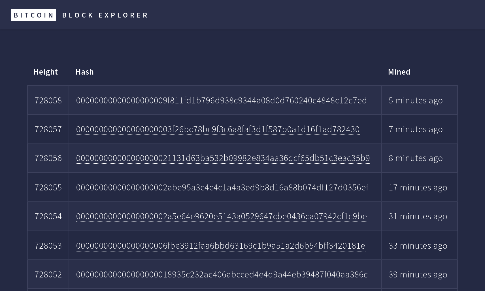

# Bitcoin Block Explorer

This is a simple Bitcoin Block Explorer. The project consists of two parts, a backend and a frontend, each in a subfolder of the same name.

## Backend

The backend uses Node.js and Express. There's an API documentation available using SwaggerUI.

### Install

Run `npm install` from within the backend folder to install the necessary Node packages.

### Run

The backend can be run with `npm start` or in a Docker container (see below).

### SwaggerUI

There's documentation available using SwaggerUI, reachable at `http://localhost:3000`.

## Frontend

The frontend uses Node.js and React.

### Install

Run `npm install` from within the frontend folder to install the necessary Node packages.

### Run

The frontend can be run with `npm start` and should be reachable at `http://localhost:3001`. There's also a Dockerfile to run it in a container (see below).

## Running with Docker

In both the backend and the frontend there's a Dockerfile. It's easiest to use the docker-compose.yml file in the root folder of the project to start both containers. Simply run `docker-compose up`.

The backend should then be reachable at `http://localhost:3000`, frontend at `http://localhost:3001`.

## Further remarks
- Design: html5up.net | @ajlkn, CCA 3.0 license (https://html5up.net/license)
